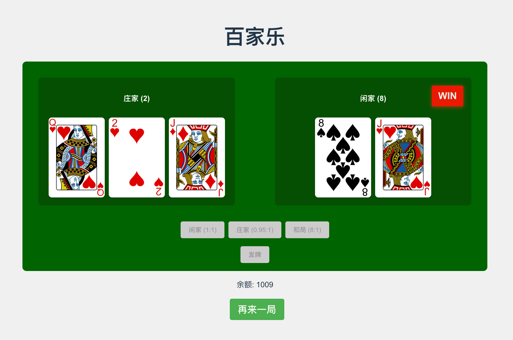

# Vue 百家乐游戏

一个使用 Vue 3、TypeScript 和 Vite 构建的现代百家乐纸牌游戏。[试一下](https://cyan0714.github.io/Baccarat/)

## 功能特点

- 经典百家乐玩法
- 互动式卡牌动画
- 游戏音效
- 现代化界面设计
- 响应式布局
- 游戏规则说明

## 技术栈

- Vue3
- TypeScript
- Vite
- CSS3 动画

## 快速开始

- clone 项目
- 运行 `npm install` 安装依赖
- 运行 `npm run dev` 启动开发环境
